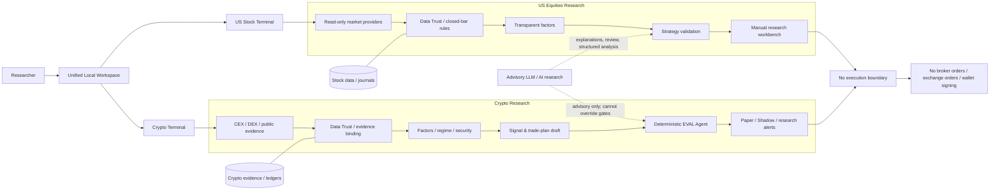

# KQUANT

[](https://github.com/Tommydiao/KQUANT-/actions/workflows/ci.yml)
[](https://www.python.org/)
[](LICENSE)
[](#safety-boundary)

**KQUANT is a research-only quantitative workspace for US equities and crypto.** It explores how trusted market-data pipelines, transparent factors, deterministic validation and advisory AI agents can work together **without giving a model authority to trade**.

The repository contains two independent research terminals plus a unified local shell:

| Project | Purpose | Local URL | Source |
| --- | --- | --- | --- |
| **KQUANT US Stocks** | Read-only stock/ETF market data, transparent factors, strategy validation, journal and manual research | `http://127.0.0.1:8001/` | repository root |
| **KQUANT CRYPTO** | CEX/DEX/MEME monitoring, Data Trust, deterministic EVAL review, Paper/Shadow research and alerts | `http://127.0.0.1:8010/` | [`crypto/`](crypto/) |
| **Unified Workspace** | Shared navigation, mode switch and health surface; runtimes remain isolated | `http://127.0.0.1:8020/` | [`platform/web/`](platform/web/) |

> **Important:** KQUANT is not a broker, exchange client, wallet, automated trading bot or investment-advice service. Backtests, model outputs and research signals do not establish future performance or real-money readiness.

## Why KQUANT

KQUANT is built around a simple principle: **AI can assist research, but evidence and deterministic rules retain authority.**

- **Read-only by design** — no broker/exchange account access, holdings, order placement, wallet signing or private-key workflows.
- **Data Trust first** — stale, forming, missing or unsupported evidence is surfaced explicitly and fails closed where it matters.
- **Transparent research logic** — factors, strategy versions, validation rules and evidence bindings are inspectable.
- **Deterministic evaluation** — the crypto EVAL layer and validation gates cannot be overridden by generated text.
- **Reproducible verification** — backend/frontend tests, CI, secret scanning and explicit boundary checks are part of the repository.
- **Human-controlled outcomes** — Paper/Shadow observations, journals and alerts support review; they do not create trade execution authority.

## Architecture



The stock and crypto applications are intentionally independent runtimes with separate APIs, databases and sessions. The unified shell provides navigation and health visibility; it is not a claim of shared authentication or shared runtime data.

## Safety Boundary

Both terminals are **research-only**:

- no exchange or broker account access;
- no holdings, positions or order-submission endpoints;
- no wallet, private-key or signing access;
- no automated trading;
- provider credentials and notification secrets are environment-only;
- forming candles, stale data, unsupported substitutions and failed evidence gates fail closed;
- LLM output is advisory and cannot change deterministic EVAL decisions or bypass safety blockers.

Run the boundary audits locally:

```powershell
# US stocks
python scripts/verify_read_only_boundary.py

# Crypto
cd crypto
python scripts/verify_read_only_boundary.py
```

## Quick Start

### Requirements

- Python 3.11+
- Node.js 22+
- npm
- Windows PowerShell for the current convenience launchers

### Unified local workspace

```powershell
# 1. Build the unified shell
cd platform\web
npm ci
npm run build

# 2. Start US Stocks from the repository root
cd ..\..
.\start_kquant_stock_terminal.ps1 -KillExisting

# 3. Start Crypto from crypto/ in a new PowerShell window
cd crypto
.\start_kquant_crypto.ps1 -KillExisting

# 4. Start the unified gateway from crypto/
.\.venv\Scripts\python.exe -m kquant_crypto gateway
```

Open `http://127.0.0.1:8020/`.

## US Stock Terminal

KQUANT US Stocks is a local, single-user stock and ETF research terminal. Longbridge is used for read-only market data; reference fallbacks cannot satisfy buy-class evidence gates.

```powershell
python -m venv .venv
.\.venv\Scripts\python -m pip install -e ".[dev]"
cd web
npm ci
npm run build
cd ..
.\start_kquant_stock_terminal.ps1 -KillExisting
```

Open `http://127.0.0.1:8001/`.

Detailed operating notes: [`docs/US_STOCK_README.md`](docs/US_STOCK_README.md).

## Crypto Terminal

KQUANT CRYPTO is an independent crypto market-research terminal with public market/evidence ingestion, Data Trust, transparent factors, deterministic EVAL review, validation and Paper/Shadow observation workflows.

```powershell
cd crypto
py -3.11 -m venv .venv
.\.venv\Scripts\python.exe -m pip install -e ".[dev]"
Copy-Item .env.example .env
.\.venv\Scripts\python.exe -m kquant_crypto db migrate
.\.venv\Scripts\python.exe -m pytest -q
cd web
npm ci
npm run build
cd ..
.\start_kquant_crypto.ps1 -KillExisting
```

Open `http://127.0.0.1:8010/`.

Detailed operating notes: [`crypto/README.md`](crypto/README.md).

## Verification

GitHub Actions verifies both terminals and the unified platform. The core local checks are:

```powershell
# US stock project
python -m pytest -q
cd web
npm test -- --run
npm run build
cd ..
python scripts/scan_tracked_secrets.py
python scripts/verify_read_only_boundary.py

# Crypto project
cd crypto
python -m pytest -q
cd web
npm test -- --run
npm run build
cd ..
python scripts/scan_tracked_secrets.py --root .
python scripts/verify_read_only_boundary.py
```

Runtime databases, Parquet data, `outputs/`, `work/`, `.env` files, virtual environments and frontend build output are excluded from version control.

## Repository Layout

```text
KQUANT-/
├─ kquant/                         # US stock backend/domain code
├─ web/                            # US stock frontend
├─ tests/                          # US stock tests
├─ crypto/                         # independent crypto terminal
├─ platform/web/                   # unified local shell
├─ docs/                           # technical and operating docs
├─ scripts/                        # verification and maintenance tools
├─ .github/workflows/ci.yml        # stock + crypto + platform CI
├─ CONTRIBUTING.md                 # contributor workflow
├─ SECURITY.md                     # vulnerability reporting policy
├─ CODE_OF_CONDUCT.md              # community standards
├─ ROADMAP.md                      # public development roadmap
└─ LICENSE                         # MIT License
```

## Public Roadmap

The public roadmap focuses on reproducibility, a unified Data Trust contract, stronger strategy/evaluation benchmarks, safer advisory-agent workflows and operational hardening. Automated execution is an explicit non-goal.

See [`ROADMAP.md`](ROADMAP.md).

Historical implementation progress is preserved in [`docs/KQUANT_84_DAY_CODEX_PLAN.md`](docs/KQUANT_84_DAY_CODEX_PLAN.md).

## Contributing

Contributions are welcome, especially around reproducible research, data-quality contracts, deterministic evaluation, tests, documentation and safe AI-assisted research workflows.

Please read [`CONTRIBUTING.md`](CONTRIBUTING.md) before opening a pull request. Security-sensitive reports should follow [`SECURITY.md`](SECURITY.md), not a public issue.

## Releases

Release notes for the OSS baseline are prepared in [`docs/releases/v0.2.0.md`](docs/releases/v0.2.0.md). The package metadata is already at `0.2.0`, so the first public OSS release should use **v0.2.0** rather than moving the version backwards to v0.1.0.

## License

KQUANT is released under the [MIT License](LICENSE).

## Disclaimer

KQUANT is provided for software engineering and quantitative-research purposes only. It does not provide investment, legal, tax or financial advice. Nothing in this repository is a guarantee of performance, and research outputs should not be treated as instructions to buy or sell financial instruments.
