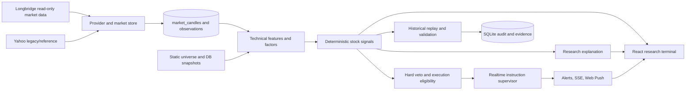

# KQUANT v2 Architecture Gap Analysis

Status: Week 1 architecture audit
Audit date: 2026-08-16
Code baseline: `codex/realtime-alerts-options-v1` at `5f34616`
Audit branch: `codex/kquant-v2-gap-analysis`

This document is an implementation audit, not a claim that KQUANT is ready for
live trading. All current broker, account, position, and order capabilities are
outside the active runtime boundary. Existing options code is a read-only
research prototype and is not the KQUANT v2 Options Engine.

The original master-plan attachment expired from its temporary location before
the audit branch was created. The user subsequently confirmed the twelve-week
execution plan now stored in `docs/KQUANT_MASTER_DEVELOPMENT_PLAN_V2.md`. That
repository document is the current execution baseline; it is explicitly marked
as a user-confirmed reconstruction rather than a byte-for-byte recovery of the
expired attachment.

## A. Architecture Summary

### Runtime shape

KQUANT is a local, single-user US-equity research terminal:

- Python 3.11 package with a FastAPI application and CLI entry point.
- React 19, TypeScript, Vite, Lightweight Charts, and Lucide frontend.
- SQLite in WAL mode as the research, audit, notification, and validation store.
- Longbridge as the primary read-only quote and candle source.
- Yahoo data retained as reference/fallback data that cannot satisfy a fresh
  buy-class eligibility check.
- A persistent realtime supervisor, SSE stream, browser Web Push, and optional
  Telegram delivery.
- Local email-and-password authentication with session cookies.
- OpenAI-backed explanation and research functions that are downstream of
  deterministic signals and hard safety gates.

The active FastAPI application exposes 80 routes. They cover authentication,
health, market data, stock research, factor snapshots, early-trend research,
alerts, notifications, journals, validation, local paper simulation, and
read-only option research. The route scan finds no active account, broker,
position, or order-submission interface.

### Current data flow



### Concentration and maintenance risk

| Module | Approximate size | Audit conclusion |
| --- | ---: | --- |
| `kquant/stock_signals.py` | 7,621 lines | Signal, data, scoring, labels, reports, and orchestration are too coupled. |
| `web/src/App.tsx` | 7,059 lines | Navigation, data access, research panels, and charts are a frontend monolith. |
| `web/src/styles.css` | 4,695 lines | Styling has no clear feature ownership boundary. |
| `kquant/stock_store.py` | 785 lines | One schema string and schema-on-connect behavior hide migration state. |
| `kquant/dashboard/app.py` | 902 lines | Route registration and application composition need feature routers. |

### Target v2 flow

The target dependency order remains:

`Data Trust -> Market Regime -> Capital Rotation -> Theme Alpha -> Leadership -> Stock Quant -> Options -> Expression -> Hard Veto -> Explanation -> Human`

Theme, model, leadership, and options decisions must never bypass Data Trust or
Hard Veto. The model layer ranks and quantifies evidence; it does not submit
orders or create hidden technical inputs.

## B. Current Capability Map

| Capability | Status | Current evidence | v2 disposition |
| --- | --- | --- | --- |
| Longbridge read-only provider | Implemented | Persistent quote context, candles, depth/calendar adapters | Retain and harden |
| Canonical market store | Partial | Source-aware candles and observations | Add snapshot lineage and availability time |
| Point-in-time universe | Partial | 17 snapshots, 2,914 memberships | Historical membership evidence is insufficient |
| Data quality | Partial | Freshness, source, forming/closed states | Normalize v2 trust states and snapshot gates |
| Market regime | Implemented baseline | Deterministic SPY/QQQ/IWM/VIX-style regime | Retain as Model 0 context |
| Technical features | Implemented baseline | EMA, ATR, RSI, volume, momentum, gap, relative strength | Version and decouple from signal monolith |
| Transparent factors | Partial | 15 DB definitions, 21 snapshots | Add feature schema, PIT lineage, cross-sectional definitions |
| Stock rule strategies | Implemented baseline | Swing, tactical, high-beta, early trend | Freeze as Model 0 controls |
| Strategy versioning | Partial | Immutable config hashes in code | Actual DB contains only five legacy registrations |
| Historical labels | Descriptive only | 80,248 overlapping stock label rows | Keep as legacy evidence, not OOS win rate |
| Historical replay | Implemented baseline | Next-bar resolver, stop-first, gap and cost handling | Reuse under versioned datasets |
| Robustness statistics | Partial | Wilson, bootstrap, concentration, sensitivity, approximate deflated Sharpe | Add predictive metrics and calibrated models |
| Formal validation | Infrastructure only | Dataset/run/trade tables exist | All three formal tables currently contain zero rows |
| Forward observation | Infrastructure only | Tables and API exist | Zero sessions and zero evaluated outcomes |
| Realtime alerts | Implemented transport | Supervisor, SSE, Web Push, Telegram option | Zero persisted instructions and alerts in audited DB |
| Theme tags | Seed data only | 246 flat tags across 26 layers | Normalize into governed taxonomy |
| Capital Rotation | Missing | No theme aggregation or CRS dataset | Phase 2 build after Data Trust |
| Theme Prediction | Missing | No predictive dataset or model artifacts | Phase 3 build |
| Leadership | Missing | No PIT theme-relative stock ranking | Phase 4 build |
| Stock Quant ML | Missing | No classifier/regressor/calibration dependencies | Phase 5 build |
| Options research | Prototype | Expiry, chain, BBO/Greeks screening, local observation | Retain adapter; defer v2 Options Engine |
| Frontend | Functional but concentrated | Research workspaces and charting in one App component | Split by feature after contracts stabilize |
| Automated tests | Strong backend, thin frontend | 157 Python tests and two frontend tests at baseline | Expand contract, migration, model, and UI coverage |

## C. Gap Analysis

### Database and lineage

The audited SQLite database is 147,210,240 bytes with 53 application tables.
`stock_store.py` declares only 47. The six tables not declared by the current
schema are:

- `equity_broker_controls`
- `equity_live_orders`
- `equity_order_intents`
- `mstr_cycle_journal`
- `mstr_cycle_runs`
- `stock_daily_runs`

They are historical/orphan data and are not active routes. They must be
quarantined, documented, and preserved until a reviewed archival migration.

Only migration version 1, `initial_stock_research_schema`, is registered even
though the live schema has expanded to 53 tables. Connections still run a large
`CREATE TABLE IF NOT EXISTS` schema and column checks, so opening the database
can silently change its structure. There is no ordered checksum migration
chain, schema fingerprint gate, or model-ready data lineage.

Missing v2 contracts include:

- Data snapshot identity and immutable item hashes.
- Source observation time versus market availability time.
- Feature schema and label schema versions.
- Dataset split and preprocessing lineage.
- Model artifact, environment, dependency, and calibration hashes.
- Theme definitions and effective-dated memberships.
- Prediction snapshots and ranked evidence.

### Universe and market data

The database has 296 active symbols while `stock_universe("all")` returns 264.
The code universe contains 26 layers and 246 unique tags. This is a source-of-
truth mismatch and a direct obstacle to reproducible cross-sectional research.

Audited canonical Longbridge coverage:

| Interval | Symbols | Rows | Available range |
| --- | ---: | ---: | --- |
| 1D | 45 | 12,529 | 2022-08-12 to 2026-08-14 |
| 1H | 42 | 2,967 | 2026-07-20 to 2026-08-13 |
| 1m | 3 | 1,950 | 2026-07-24 to 2026-08-13 |
| 5m | 2 | 234 | 2026-08-07 to 2026-08-13 |
| 1W | 42 | 10,546 | 2021-08-02 to 2026-08-10 |
| 1M | 41 | 4,475 | 2016-08-01 to 2026-08-01 |

Daily and 1H coverage are approximately 15.2% and 14.2% of the 296-symbol DB
universe, far below the 90% development gate. Corporate action storage contains
only four events. The project cannot yet support trustworthy theme breadth,
cross-sectional ranking, or production-grade predictive datasets.

### Features and labels

Current registered feature groups include:

- EMA 8/9/20/50/200 structure and trend returns.
- Confirmation-period EMA structure and momentum.
- Relative volume, ATR risk, EMA20 extension, RSI, gap risk.
- Relative strength against SPY and QQQ.
- VWAP reclaim, market breadth, and corporate-event context.
- Early-trend setup factors for relative-strength acceleration, accumulation,
  platform breakout, ATR compression, and expansion risk.

Only a subset has active score contributions. The registry does not yet provide
cross-sectional percentile definitions, immutable preprocessing versions, or a
guaranteed shared real-time/backtest execution contract.

Persisted stock labels are:

- `forward_return_3d`
- `forward_return_5d`
- `forward_return_10d`
- `max_drawdown_5d`
- `hit_target_before_stop`
- `close_above_entry_after_5d`

They were generated as overlapping descriptive observations. They lack dataset,
label-schema, source, and strategy versions and must not be presented as formal
strategy win rate. Formal realized-R validation tables are empty.

### Mathematical and statistical models

There is no current dependency or implementation for scikit-learn, LightGBM,
XGBoost, SciPy, statsmodels, Logistic Regression, quantile regression, Platt
scaling, isotonic calibration, ROC AUC, Brier score, or ECE.

Existing quantitative components are valuable baselines rather than predictive
models:

- Deterministic stock and early-trend scores.
- Deterministic market regime and hard veto.
- Chronological 60/20/20 split and embargo utilities.
- Next-bar trade resolution, stop-first, gap, commission, and slippage logic.
- Wilson confidence intervals and seeded bootstrap intervals.
- Parameter sensitivity, concentration, regime, portfolio, and approximate
  deflated-Sharpe reports.

### Theme taxonomy

Current tags cannot directly form a Theme Taxonomy. They mix themes (`space`,
`robotics`), sectors, styles (`quality`, `high_beta`), risk descriptors,
liquidity, and instruments (`sector_etf`). Many are singletons. There are no
canonical theme IDs, hierarchy, aliases, effective dates, evidence, review
status, or ETF mappings. They can seed a taxonomy only after normalization and
manual review.

### Frontend and API gaps

The API is broad but concentrated in one route module. There are no `/api/data`,
`/api/themes`, `/api/models`, `/api/leadership`, or `/api/quant` v2 contracts.
The frontend has no Capital Rotation, taxonomy audit, calibrated probability,
leadership, or Quant Edge workspace. Its production bundle currently exceeds
Vite's 500 kB chunk warning threshold, and frontend tests cover only two small
formatting cases.

Documentation has drifted: `production_architecture.md` says the runtime has no
options, while the active application contains read-only options research
routes. Documentation must distinguish a read-only options prototype from an
Options Engine or execution capability.

## D. Reuse Plan

### Retain as foundations

- `longbridge_provider`, `market_store`, data quality, market clock, and calendar.
- Universe snapshots and membership storage, after PIT semantics are corrected.
- `technical_features`, the factor registry pattern, and deterministic scoring.
- `strategy_registry`, hard-veto rules, early-trend strategy, and strategy freeze.
- Historical replay, trade resolver, portfolio simulation, validation splits,
  bootstrap, sensitivity, concentration, and regime reports.
- Authentication, audit events, backups, health, notification transports, SSE,
  Web Push, and the read-only route scanner.
- Existing options adapter and quote persistence as a future raw-input layer.

### Capital Rotation reuse

Capital Rotation can reuse canonical candles, benchmark-relative return helpers,
market breadth primitives, market regime, date splitting, embargo, bootstrap,
and universe snapshots. It cannot reuse the current stock score as a Capital
Rotation Score. Theme aggregation requires effective-dated membership and
cross-sectional feature definitions.

### Preserve as controls

The current rule strategies remain frozen Model 0 baselines. Their outputs are
needed to prove whether later statistical models add stable OOS value. Legacy
labels and Yahoo observations remain available for historical audit but are
explicitly excluded from eligible predictive datasets.

### Deprecate only after parity

- Monolithic orchestration and duplicated indicator code in `stock_signals.py`.
- Schema-on-connect and the single `SCHEMA` string in `stock_store.py`.
- Legacy `stock_candles` as an active modeling source.
- Flat tags as a direct runtime taxonomy.
- Legacy AI packet versions and descriptive `historical_edge` near decisions.
- Monolithic `App.tsx` and global feature styling.
- Heuristic options ranking once a separately validated Options Engine exists.

No item in this list is deleted during the audit or the first additive migration.

## E. Migration Plan

1. Create and verify a SQLite backup and record table, index, row-count, and
   schema hashes before every migration.
2. Introduce `kquant/db` with an ordered migration registry, checksums,
   transactions, and explicit failure records.
3. Register the existing database as a legacy baseline without rewriting rows.
4. Add Data Snapshot, Feature Schema, Label Schema, Dataset, Model Artifact,
   Theme, Leadership, and Prediction tables through forward-only migrations.
5. Keep old tables and APIs operational through compatibility repositories.
6. Backfill only by copying with provenance, availability time, source, and
   `legacy_reference` or `survivorship_limited` status.
7. Verify row counts, time ranges, hashes, null rates, and sampled values before
   switching a reader to the v2 repository.
8. Make legacy readers read-only after parity; archive or drop only in a later,
   separately approved migration.
9. Define future Options schema contracts only after Stock Quant passes OOS
   gates. Do not activate an Options model in Phases 1-5.

Proposed package boundaries:

```text
kquant/db/             connection, migrator, migrations, schema fingerprints
kquant/data/           snapshots, lineage, coverage, availability contracts
kquant/themes/         taxonomy, features, rotation, labels, models, leadership
kquant/models/         datasets, splits, registry, metrics, calibration, artifacts
kquant/quant/          stock features, labels, models, ranking, validation
kquant/dashboard/      feature routers and stable compatibility routes
web/src/features/      data trust, themes, leadership, quant, operations
```

## F. Risk Register

| Risk | Severity | Likelihood | Control | Blocking gate |
| --- | --- | --- | --- | --- |
| Current universe projected into history | Critical | High | Effective-dated membership; `survivorship_limited` status | Data Trust |
| Theme membership assigned with hindsight | Critical | High | Versioned taxonomy and membership approval dates | Taxonomy |
| Future or forming bars enter features | Critical | Medium | Closed-bar and availability-time assertions | Data Snapshot |
| Adjusted and raw prices are mixed | Critical | Medium | Dataset adjustment contract and corporate-action checks | Data Trust |
| Yahoo reference enters eligible datasets | High | Medium | Dataset source allowlist and fail-closed eligibility | Data Trust |
| Overlapping labels cross split boundaries | Critical | High | Date split, purge, and maximum-horizon embargo | Model Dataset |
| Preprocessing sees validation/test data | Critical | Medium | Fit artifacts per training fold and hash them | Model Dataset |
| Test set reused during tuning | Critical | Medium | Sealed test registry and immutable run metadata | Prediction |
| Calibration uses test labels | High | Medium | Validation-only calibration artifact | Prediction |
| Theme result dominated by one stock | High | High | Contribution cap and leave-one-out report | Rotation |
| Cross-sectional timestamps differ | High | Medium | One snapshot ID per ranking surface | Leadership |
| Legacy close-entry labels imply tradability | High | High | Legacy label badge; formal next-bar resolver | Stock Quant |
| Model artifact and data version mismatch | Critical | Medium | Fail-closed content hash verification | All model gates |
| Sparse company actions distort returns | High | High | Coverage gate and caution exclusion | Data Trust |
| Large monolith causes accidental behavior drift | Medium | High | Characterization tests before extraction | All phases |
| Thin frontend tests hide contract regressions | Medium | High | Feature-level API and rendering tests | Product integration |

## G. Phase 1-5 Implementation Plan

### Phase 1: Data Trust Foundation

Primary files/packages:

- Add `kquant/db` and `kquant/data` packages.
- Adapt `market_store.py`, `stock_store.py`, `stock_universe.py`, and health APIs.
- Add Data Trust frontend feature and compatibility routes.

Deliver explicit migrations, snapshot lineage, availability time, source status,
PIT universe access, canonical coverage, and reproducible snapshot hashes.
Resolve the 264-versus-296 universe mismatch through one versioned registry; do
not delete historical memberships.

Leakage focus: current constituents in history, backfill availability time,
forming bars, corporate actions, and source overwrite.

### Phase 2: Capital Rotation V0.1

Primary files/packages:

- Add `config/theme_taxonomy_v1.yml`.
- Add taxonomy, theme feature, rotation, and theme repository modules.
- Add theme routers and `web/src/features/themes`.

Build closed-bar PIT theme returns, relative strength, acceleration, breadth,
volume, dollar volume, proxy flow, persistence, and a deterministic CRS. Themes
with fewer than five eligible members remain unranked.

Leakage focus: retrospective memberships, same-day close use, proxy labeling,
survivor-only breadth, and single-leader concentration.

### Phase 3: Theme Prediction

Primary files/packages:

- Add shared model dataset, split, registry, metric, calibration, and artifact
  modules.
- Add theme labels, predictive models, validation services, and model APIs.

Start with naive and CRS baselines, then Logistic Regression. LightGBM,
regression, and quantile models are comparisons, not assumed winners. Use
rolling chronological OOS folds, purge/embargo, validation-only calibration,
and a sealed test set.

Leakage focus: random split, global preprocessing, hyperparameter test reuse,
overlapping labels, and benchmark-time mismatch.

### Phase 4: Leadership Engine

Primary files/packages:

- Add theme-relative leadership features and ranking services.
- Add leadership storage, routes, and theme-detail UI panels.

Rank stocks only inside one immutable Theme Snapshot using lagged theme state,
stock relative strength, breadth participation, volume, and persistence. Expose
Leader, Emerging, Neutral, and Weakening categories with evidence.

Leakage focus: future theme prediction, inconsistent cross-sectional times, and
incomplete historical membership.

### Phase 5: Stock Quant V1

Primary files/packages:

- Add `kquant/quant` feature, label, model, ranking, validation, and Quant Edge
  modules.
- Add `/api/quant/stocks` contracts and feature-owned frontend components.
- Keep current `/api/stocks` routes stable through compatibility adapters.

Use the current rule engine as Model 0. Add Logistic, LightGBM classification and
regression, and quantile comparisons only after the shared dataset contract is
locked. Add theme and leadership factors without allowing them to bypass data
quality or hard veto.

Leakage focus: real-time/backtest feature divergence, close-entry labels,
cross-sectional future data, repeated test selection, and quantile calibration.

## H. Tests

### Phase 1

- Migration ordering, checksum mismatch, idempotence, transaction rollback.
- Empty database, audited existing database, backup, and restore drill.
- PIT universe queries, availability cutoffs, source precedence, adjustment mode.
- Forming bars, future timestamps, duplicates, company actions, and hash replay.

### Phase 2

- Taxonomy schema and alias validation.
- Effective-dated membership and historical lookup.
- Theme weighting, minimum member count, contribution caps, missing data.
- Deterministic CRS replay and leave-largest-member-out stability.

### Phase 3

- Date-only splitting, purge, embargo, and future-data perturbation sentinels.
- Fold-scoped preprocessing and reproducible artifacts.
- AUC, Brier, ECE, rank IC, quantile coverage, and calibration fixtures.
- Model/data/version mismatch must fail closed.

### Phase 4

- One snapshot per cross section, lagged theme input, tie handling.
- Minimum constituent count, concentration, and incomplete-universe behavior.
- OOS leader basket versus theme-equal-weight benchmark.

### Phase 5

- Real-time and replay feature parity.
- Next-bar entry, gap execution, stop-first, costs, and corporate actions.
- Classification calibration, regression error, quantile coverage, robustness,
  concentration, and conservative-cost scenarios.
- Stable current APIs and read-only route boundary.

Every phase also runs the full Python suite, frontend tests and production build,
the secret scan, read-only route scan, and `git diff --check`.

## I. Go/No-Go Gates

### Phase 1 gate

- One authoritative current universe with deterministic version and hash.
- Every eligible input has source, `as_of`, `available_at`, and version metadata.
- Longbridge 1D and 1H coverage reaches at least 90% of the modeling universe.
- No Yahoo or forming-bar observations enter eligible model snapshots.
- Backup/restore and repeated migration pass with matching hashes.

Failure result: `NO_GO_DATA`; later model work remains blocked.

### Phase 2 gate

- At least 95% of eligible symbols are reviewed/mapped or explicitly unmapped.
- Memberships have effective dates and evidence.
- Ranked themes have at least five eligible members.
- CRS is deterministic and stable after removing the largest constituent.

Failure result: taxonomy remains audit-only; no Theme Prediction training.

### Phase 3 gate

- At least three OOS folds.
- AUC confidence lower bound exceeds 0.5.
- Brier score beats climatology and OOS rank IC is positive.
- Top-ranked theme excess return is positive after conservative costs.
- Recommended ECE is no more than 0.05.

Failure result: retain deterministic CRS; do not show predictive probabilities.

### Phase 4 gate

- OOS leader basket beats theme equal weight after conservative costs.
- Rank IC is positive across multiple folds and regimes.
- No single stock or theme explains the result.

Failure result: leadership remains descriptive and cannot feed Stock Quant.

### Phase 5 gate

- At least 100 completed sealed-test trades.
- Average R 95% bootstrap lower bound is above zero.
- Profit Factor is at least 1.25 and at least 1.05 under conservative costs.
- Maximum drawdown is no more than 8%.
- Removing the best five symbols leaves positive expected value.
- One symbol contributes no more than 15% of total profit.
- Predictive calibration beats the frozen Model 0 baseline.

Passing these gates permits Shadow Observation only. It does not authorize live
orders or automatic execution.

## J. Recommended First Commit

Create one documentation-only commit:

```text
docs(v2): add master plan and architecture gap analysis
```

Expected contents:

- User-confirmed `docs/KQUANT_MASTER_DEVELOPMENT_PLAN_V2.md`.
- This `docs/KQUANT_V2_GAP_ANALYSIS.md`.
- `docs/daily/2026-08-16.md` with the evidence and Week 1 gate result.

The original temporary attachment is unavailable, so its replacement carries a
clear provenance note. No production code, schema migration, model dependency,
or database row belongs in this first commit.
